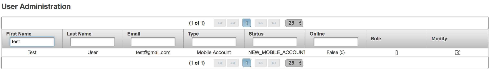
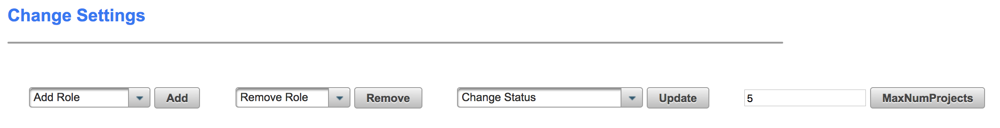
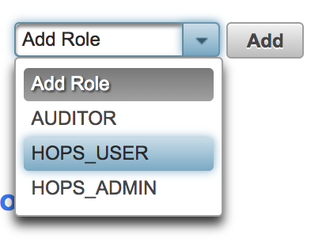
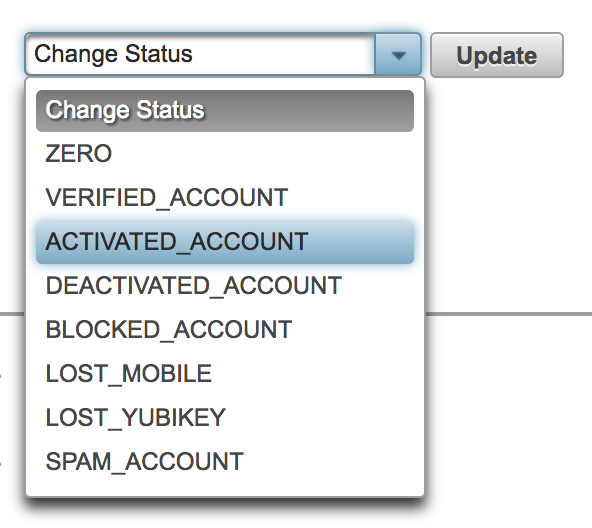

===========================
Activating users
===========================

You, the administrator, have to approve each new user account before the user is able to login to HopsWorks.
When you approve the account, you have to assign a role to a user as either an:

 * user
 * administrator

Users that are assigned an **administrator** role will be granted privileges to login to the **administrator application** and control users and the system. Be careful in which users are assigned an **administrator** role. The vast majority of users will be assigned a **user** role.

+----------------------------------------+
|            |activateuser1|             |
+----------------------------------------+
|            |activateuser2|             |
+-------------------+--------------------+
| |activateuser3|   +   |activateuser4|  +
+-------------------+--------------------+
